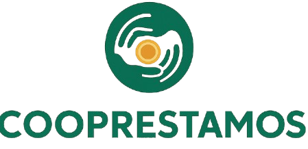

<table>
  <tr>
    <td width="210" align="center" valign="middle">
      
    </td>
    <td valign="middle">
      <h1 align="center">COOPRESTAMOS – Sistema de Gestión de Préstamos y Pagos para Cooperativa</h1>
      <p align="center">
        
        
        
        
      </p>
    </td>
  </tr>
</table>

<hr/>


## 👀 Visión del Proyecto
Sistema integral para la gestión del ciclo completo de préstamos en una cooperativa, desde la solicitud hasta el cierre, incluyendo registro de pagos, control de morosidad y generación de reportes financieros.

---

## 🎯 Objetivo Académico
Proyecto correspondiente a la asignatura **Desarrollo de Software 2**, orientado a aplicar:

- Ciclo de vida **DevOps**
- Metodología **Scrum** con tablero **Kanban**
- **Pruebas unitarias** y **Refactoring (TDD)**
- Buenas prácticas: mantenibilidad, modularidad, cohesión y bajo acoplamiento

---

## 👨‍💻 Equipo de Trabajo
| Rol | Integrante |
|-----|-------------|
| Base de Datos | **Angie Stefany Herrera** |
| Backend | **Jorge Iván Jaramillo** |
| Backend | **Jorge Luis Toro** |
| Frontend y Kanban | **José Fabián Ortiz** |

---

## 📁 Estructura del Proyecto

## coop-prestamos-pagos/
│

├── backend/ # API Django (lógica, modelos y endpoints)

│ ├── manage.py

│ ├── core/

│ ├── apps/

│ └── requirements.txt

│

├── frontend/ # Interfaz de usuario (React + Vite)

│ ├── package.json

│ ├── vite.config.ts

│ └── src/

│

├── entorno-desarrollo/ # Archivos técnicos

│ ├── .env.example

│ ├── docker-compose.yml

│ └── scripts/

│

├── docs/ # Documentación técnica y académica

│ ├── base-de-datos/

│ ├── casos-uso/

│ └── manuales/

│

├── .gitignore

└── README.md

---

## ⚙️ Tecnologías Principales

| Componente | Tecnología |
|-------------|-------------|
| Backend | **Python 3.12 + Django Rest Framework** |
| Frontend | **React + TypeScript + Vite** |
| Base de Datos | **MySQL / MariaDB** |
| Control de versiones | **Git y GitHub Projects (Kanban)** |

---

## 🚀 Instalación y Ejecución

### 🔧 1. Clonar el repositorio
```bash
git clone https://github.com/JFabian2606/coop-prestamos-pagos.git
cd coop-prestamos-pagos
```

---

### 🐍 2. Backend (Django)

cd backend
python -m venv .venv
source .venv/Scripts/activate
pip install -r requirements.txt
python manage.py migrate
python manage.py runserver

---

### ⚛️ 3. Frontend (React + Vite)
cd frontend
npm install
npm run dev

---

### 🧩 Variables de Entorno (.env)
SECRET_KEY=tu_clave_secreta

DEBUG=True

DB_NAME=coop_prestamos

DB_USER=root

DB_PASSWORD=

DB_HOST=localhost

DB_PORT=3306

---

# Frontend
VITE_API_URL=http://127.0.0.1:8000/api/

---

### 📋 Organización del Backlog

- Épicas actuales

- Gestión de Socios → Registro, actualización e historial crediticio

- Configuración de Productos de Préstamo

- Configuración General del Sistema

- Solicitud y aprobación de préstamos

- Desembolsos

- Sistema de pagos y cobranza

- Reportes y notificaciones

### 🧰 Herramientas de apoyo

Draw.io / PlantUML → Diagramas UML y de flujo

MySQL Workbench → Modelado físico de base de datos

VSCode → Desarrollo colaborativo

GitHub Issues & Projects → Seguimiento ágil del equipo

### 🗂️ Documentación

Los diagramas y modelos de base de datos se encuentran en la carpeta:

```docs/base-de-datos/```

### 🏁 Estado actual

- ✔️ Entorno de desarrollo configurado
- ✔️ Estructura profesional del repositorio
- ✔️ Conexión a base de datos
- 🚧 En progreso: Módulo de Gestión de Socios

### 📅 Próximos pasos

- Terminar CRUD de Socios

- Implementar autenticación

- Integrar frontend con API REST

- Pruebas unitarias (pytest, jest)
